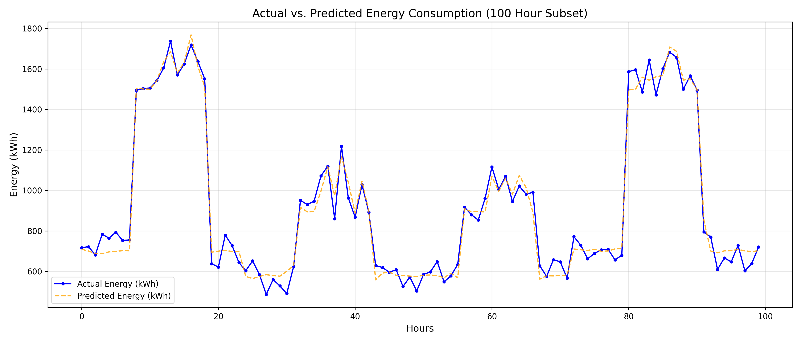
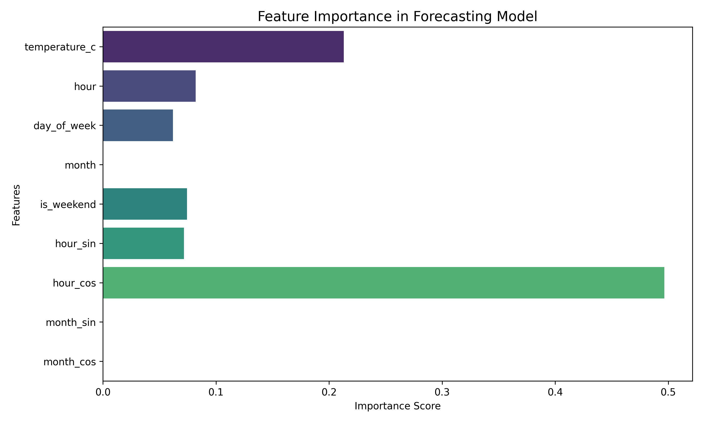

# AI-Powered Energy Consumption Forecasting System ⚡🏙️


## 📌 Overview
An industry-oriented implementation of an AI-based forecasting system that predicts hourly electrical energy consumption based on historical usage and external temperature variations. 

## 🏭 Problem Statement & Industry Relevance
Energy cannot be easily stored in large capacities. In smart cities, manufacturing plants, and data centers, knowing exactly how much energy will be needed allows businesses to dynamically balance loads, reduce carbon footprint, and participate in "Peak Load Shaving" to save millions of dollars in variable peak energy tariffs.

## 🛠️ Tech Stack
- **Language:** Python
- **Libraries:** Pandas, NumPy (Data Manipulation), Scikit-learn (Machine Learning), Matplotlib, Seaborn (Data Visualization)
- **Model:** Random Forest Regressor (Selected for robust non-linear tabular mapping without intensive GPU requirements)

## 📈 Architecture & Data Flow
1. **Synthetic Data Generation:** Models a factory's daily bounds, weekend drop-off, base loads, and HVAC spikes.
2. **Feature Engineering:** Cyclic conversions for Time/Months, weekend markers.
3. **ML Pipeline:** Train/Test split, Model Training, Metric Evaluation (RMSE, R2).

## 🚀 Installation

```bash
# Clone the repository
git clone https://github.com/YourUsername/AI-Energy-Consumption-Forecasting.git
cd AI-Energy-Consumption-Forecasting

# Install Requirements
pip install -r requirements.txt

# Run the complete pipeline
python main.py
```

## 📊 Results & Visualization
### Actual vs Predicted


### Model Features Importance


## 🎯 Learning Outcomes Demonstrated
- Time-series Regression using Tree-based ensemble models.
- End-to-end Machine Learning pipeline modularization.
- Feature Engineering on datetime vectors (Cyclic encoding).
- Meaningful generation of synthetic business data.
